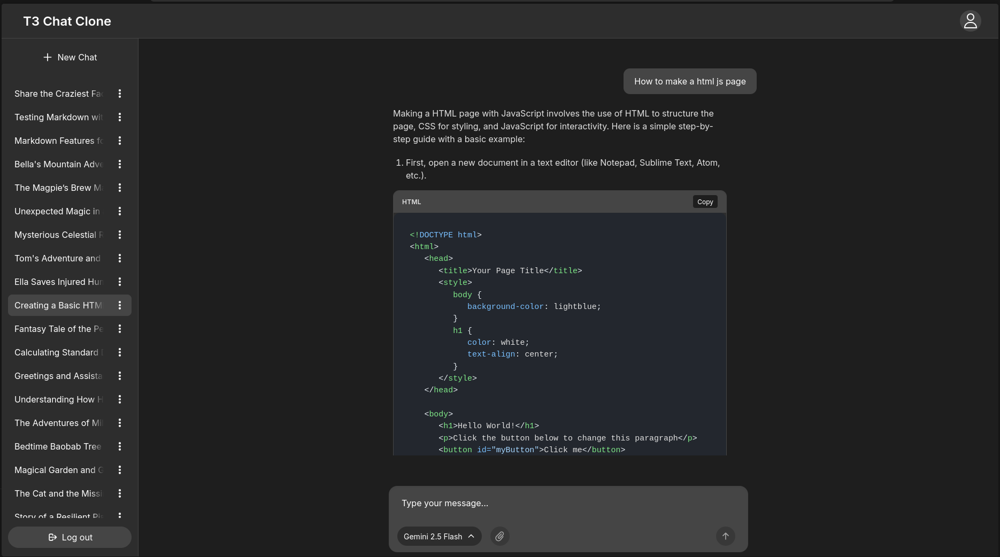
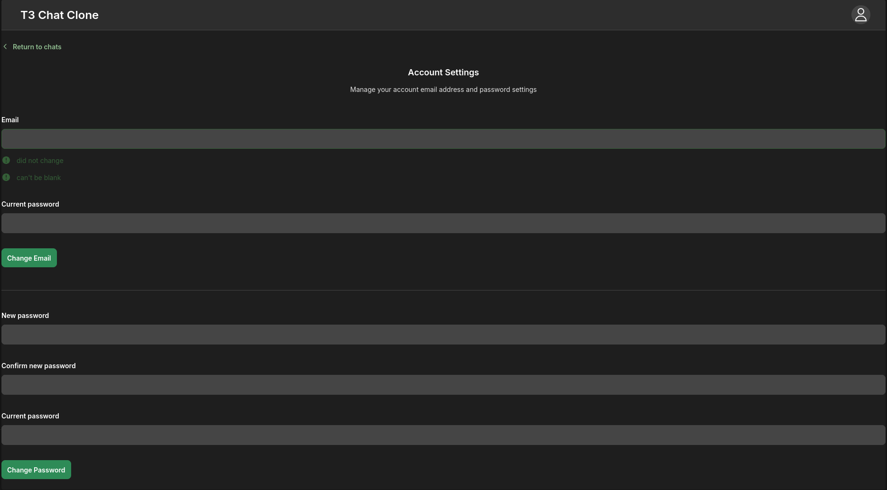
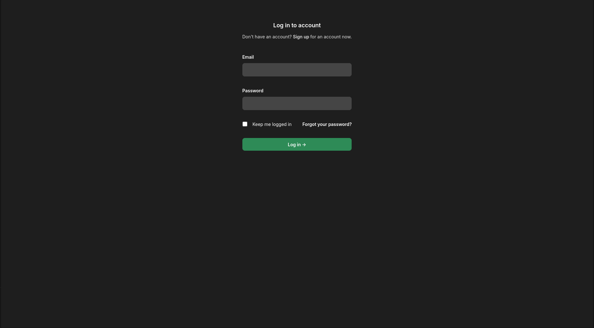

# T3CloneElixir: Open Source AI Chat App Clone

[](https://www.phoenixframework.org/)
[](#license)

## 🌐 Live Demo

▶️ [Check out the hosted app here!](https://t3-clone-elixir.fly.dev/)

A high-performance, open-source AI chat app supporting multiple LLM providers, real-time streaming, markdown/code rendering, and more. Built for the [T3 ChatCloneathon](https://coleneathon.t3.chat) competition.

---

## 🚀 Demo

> **Try locally:** See [Getting Started](#getting-started)

---

## 🗂️ Table of Contents
- [Some Abstraction](#some-abstraction)
- [Features](#features)
- [Screenshots](#screenshots)
- [Getting Started](#getting-started)
- [Usage](#usage)
- [Contributing](#contributing)
- [License](#license)
- [Acknowledgements](#acknowledgements)
- [Contributors](#contributors)

---

## 📝 Some Abstraction

Before I start writing about this project, I personally want to say thank you for this opportunity. 

Me participating in the Clonathon was purely coincidential.  

The challenge wasn't easy, but it was a lot of fun and I learned a bunch of cool things about Elixir, Phoenix, LiveView and creating cool web apps in general.

The key challenge (as always, I assume) was time management. I understand that's the whole point. And the front end, of course...

I know that you love Elixir. I watched many of your videos about it and your inspiring conference performance about how Elixir saved your career. You are one of the reasons I decided to stick with it.

Hope you enjoy trying it out as much as I enjoyed making it.
 

## ✨ Features

Click to jump to details:
- [Multi-Provider LLM Chat](#multi-provider-llm-chat)
- [Authentication & Sync](#authentication--sync)
- [Streaming Responses](#streaming-responses)
- [Chat CRUD](#chat-crud)
- [Resumable Streams and Stream Cancellation](#resumable-streams-and-stream-cancellation)
- [User Input Drafts](#user-input-drafts)
- [Fast ETS Caching](#fast-ets-caching)
- [Other Features](#some-other-features-worth-mentioning)

---

### Multi-Provider LLM Chat
I took the simplest solution I could think of. I used the OpenRouter API to support multiple providers and recreated their Python API in Elixir (with a little help from AI) in [`openrouter_generator.ex`](lib/t3_clone_elixir/openrouter_generator.ex).

---

### Authentication & Sync
The CLASSIQUE `phx.gen.auth`. Generators rule!

---

### Streaming Responses
This was not easy...

I used the OpenRouter API to stream the tokens, then accumulated them in a GenServer and sent them into LiveView PubSub in [`chat_server.ex`](lib/t3_clone_elixir/chat_server.ex). And that was the easiest part.

Can't say the same for the client side.

This required a little trick. I found a really cool MDeX library that allowed me to render GitHub-style HTML from Markdown on the server—it even supports syntax highlighting out of the box! Very impressive, but I still had to write a parser to make code blocks with a copy button. You can find the code here: [`chat_messages.ex`](lib/t3_clone_elixir_web/live/chat_live/home_components/chat_messages.ex).

Unfortunately, I failed LaTeX support. I didn't find a server solution and client-side libraries did not work since I already shipped rendered and styled HTML.

---

### Chat CRUD & Branching
`Create`, `delete`, and `rename` chats.

I implemented the schemas to support simple branching but ran out of time to finish the feature.

---

### Resumable Streams and Stream Cancellation
This is the part I'm most proud of.

Since I initially created a GenServer to accumulate the tokens, I just had to add the necessary logic there to support resumable streams.

While the stream continues, the server builds a buffer that is loaded when a user reloads the page. That way, the user not only sees the tokens that were already generated while they were away, but the stream also continues.

A couple of additional states allowed for cancellation of the stream and clearing the buffer.

---

### User Input Drafts

I can't live without drafts. One of the simplest and most useful features that I made. Just save the input in the GenServer and send it to the LiveView when the user reloads the page. Here is the file: [`input_draft_server.ex`](lib/t3_clone_elixir/input_draft_server.ex).

---

### Fast ETS Caching
This is one of the things that I didn't have time to do.

In one of your videos, you described how you cache chats locally in the browser for instant access. I really liked this idea and wanted to instead cache the chats in an ETS table. This approach would give sub-millisecond response time and would feel almost instant.

---
## Some Other Features Worth Mentioning
- Pagination
- Copying messages and code blocks
- Saving last used model in the chat
- Automatic scroll down while generating
- AI renaming of new chats
- Simple admin panel for adding new models in the app (`/models`)
---


## 🖼️ Screenshots




---

## 🛠️ Getting Started

### Prerequisites
- Elixir & Erlang (see [install guide](https://elixir-lang.org/install.html))
- Node.js & npm
- PostgreSQL

### Environment & Secrets
1. Copy the example environment file and fill in your API keys and secrets:
   ```bash
   cp .env.example .env
   # Edit .env and add your OpenRouter, OpenAI, or Anthropic API keys, and any other required secrets
   ```

2. Fill in the following variables in your `.env` file:
   - `OPENROUTER_API_KEY` — **Required.** Your API key for [OpenRouter](https://openrouter.ai/). Sign up and generate a key on their website. This enables all LLM features in the app.
   - `ADMIN_EMAIL` — **Required.** The email address for the admin user. On first boot, the app will create (or expects) an admin account with this email. Use a valid email you control.
   - `ADMIN_PASSWORD` — **Required.** The password for the admin user. Choose a strong password.

   **Example:**
   ```env
   OPENROUTER_API_KEY=sk-...yourkey...
   ADMIN_EMAIL=admin@example.com
   ADMIN_PASSWORD=supersecret
   ```

### Local Development
```bash
# 1. Clone the repo
$ git clone https://github.com/yourusername/t3_clone_elixir.git
$ cd t3_clone_elixir

# 2. Setup dependencies & DB
$ mix setup

# 3. Start Phoenix server
$ mix phx.server
# or with IEx
$ iex -S mix phx.server

# App runs at http://localhost:4000
```

### Deploying to Fly.io
```bash
# 1. Install Fly CLI
curl -L https://fly.io/install.sh | sh

# 2. Authenticate
fly auth login

# 3. Launch (creates fly.toml)
fly launch

# 5. Open your deployed app
fly apps open
```

See [Fly.io Phoenix guide](https://fly.io/docs/elixir/getting-started/) for production DB setup.

---

## 📖 Usage
- Register/login
- Start a new chat, select model/provider
- Type your prompt and enjoy real-time streaming

---

## 🤝 Contributing
PRs and issues welcome! See [CONTRIBUTING.md](CONTRIBUTING.md) (or open an issue).

---

## 📝 License

MIT License

Copyright (c) 2025 Daniel 

Permission is hereby granted, free of charge, to any person obtaining a copy
of this software and associated documentation files (the "Software"), to deal
in the Software without restriction, including without limitation the rights
to use, copy, modify, merge, publish, distribute, sublicense, and/or sell
copies of the Software, and to permit persons to whom the Software is
furnished to do so, subject to the following conditions:

The above copyright notice and this permission notice shall be included in all
copies or substantial portions of the Software.

THE SOFTWARE IS PROVIDED "AS IS", WITHOUT WARRANTY OF ANY KIND, EXPRESS OR
IMPLIED, INCLUDING BUT NOT LIMITED TO THE WARRANTIES OF MERCHANTABILITY,
FITNESS FOR A PARTICULAR PURPOSE AND NONINFRINGEMENT. IN NO EVENT SHALL THE
AUTHORS OR COPYRIGHT HOLDERS BE LIABLE FOR ANY CLAIM, DAMAGES OR OTHER
LIABILITY, WHETHER IN AN ACTION OF CONTRACT, TORT OR OTHERWISE, ARISING FROM,
OUT OF OR IN CONNECTION WITH THE SOFTWARE OR THE USE OR OTHER DEALINGS IN THE
SOFTWARE.

---

## 🙏 Acknowledgements
- [Phoenix Framework](https://www.phoenixframework.org/)
- [OpenRouter](https://openrouter.ai/)
- [Fly.io](https://fly.io/)
- [MDEx](https://github.com/leandrocp/mdex)
---

## 👤 Contributors
- Daniel (Me) ([@Cry5tal](https://github.com/Cry5tal)) - vasilenkoden14@gmail.com
